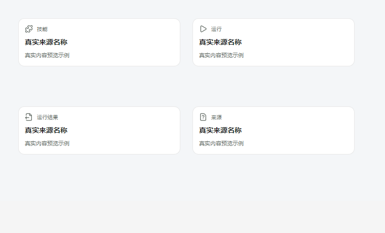

# GenericSourceMorphology 身份映射修复（2026-09-29）

## 结论

来源族为 `skill / run / output / unknown` 时，画面不再直接显示英文 resolver key，也不再全部复用文件文本图标。标签改为“技能 / 运行 / 运行结果 / 来源”，分别采用 Puzzle / Play / FileOutput / FileQuestion 图标；family key 仅保留在 `data-*` 诊断属性中。专用媒体族 `text / document / image / audio / web / video` 的分派和领域身份解析未改。

## 修改

- `huabu/apps/web/src/lcos/nodes/source/SourceMorphology.tsx`：增加 generic family 身份呈现表，连接对应图标、中文标签，并透传现有 `density` 到视图节点。
- `huabu/apps/web/src/lcos/nodes/LcosSpeciesBodies.test.tsx`：增加四个 generic family 的标签和非裸 key 断言。

该组件只负责仍未拥有专属媒体 body 的 family；本修复不声称补齐 skill/run/output 的独立对象形态或业务操作。

## 依据与验证

- T1 路线原卡 `references/original_route_cards/T1/42_T1_Huabu_Gen1_Spatial_Granularity_Recovery_v1.md` §10 明确指出新版 species-specific HTML 尚未完成；所以这次只纠正身份反馈，不臆造专属造型。
- `apps/web-gen2/src/presentation/visualFamily.ts` 的权威解析仍输出 `skill / run / output / unknown`，视图映射基于这些真实 family，不从标题或 ID 猜类型。
- 定向测试：`pnpm --filter @huabu/web test -- --run src/lcos/nodes/LcosSpeciesBodies.test.tsx`，1 文件、9 项通过。
- 使用 Vite 生产入口样式 `src/index.css` 加载隔离组件并截图；浏览器取得应用 CSS 字体栈，画面为无衬线。截图是组件隔离示意，不是整页 Canvas 实测。Figma 包未随包提供字体二进制，浏览器按 app 字体栈使用本机可用字体。

## 未覆盖

专属 skill/run/output 形态、unknown 的细分失败原因、远景 mark 是否应改为纯身份符号仍需回到已绑定的设计源与对应业务 descriptor 再做；此处保留当前卡片结构，不把未证实的视觉方向冒充 Figma 结论。
