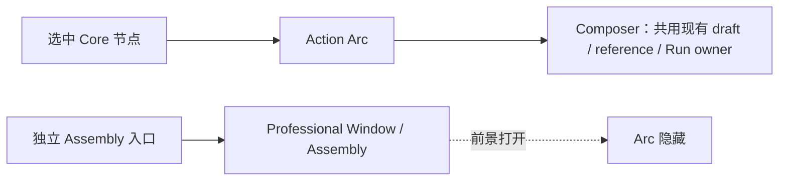

# GEN2 Arc / Composer 纠偏回执

日期：2026-09-14
范围：`apps/web-gen2` 命令模型、Huabu Action Arc；保留工作区既有脏改动，不提交、不推送。

## 结论

已完成一处可验证的 UX 纠偏：Assembly 已从节点 Action Arc 的命令模型与 dispatch 移除，继续由独立项目级入口打开。对象近场保留 `compose`，所以“围绕对象工作”仍进入现有 Composer；没有新增 transport、session 或 reference store。

Work View 现在挂载同一个 `LcosComposerHost` 的 inline 形态，共用 Shell 中的 prompt 草稿和 Reference Store。Canvas overlay 在 Professional Window 活跃时自动让位，因此同一 Composer intent 不会双渲染。

同时，Professional Window 打开时 Action Arc 会让位，避免 Arc 浮在 Reader、Assembly、Portal 或 Conversation Work View 上方干扰操作。

## 变更流程

## 修改文件

- `apps/web-gen2/src/interaction/nodeCommandModel.ts`
  - 删除 `assembly` 命令 id、绑定节点时的 Assembly 命令和近场候选。
  - 保留 `compose`，继续消费现有 Composer。
- `apps/web-gen2/test/node-command-model.test.ts`
  - 验证绑定节点近场为 `open / compose / reference`。
  - 验证 Assembly 不再从节点命令模型出现。
- `huabu/apps/web/src/lcos/navigation/LcosActionArc.tsx`
  - 删除 Assembly 图标与 dispatch 分支。
  - Professional Window 有活动窗口时隐藏 Arc。
- `huabu/apps/web/src/lcos/shell/lcosShellStore.ts`
  - Composer target 增加可选 canonical `receiverConversationId` 与真实阻塞原因。
- `huabu/apps/web/src/lcos/LcosHostOverlay.tsx`
  - Professional Window 活跃时关闭 canvas Composer 挂载，避免重复。
- `huabu/apps/web/src/lcos/composer/LcosComposerHost.tsx`
  - 增加 inline 宿主；保留同一 prompt/reference 草稿。
  - Work View 仅在明确 receiverConversationId 时附带 `receiverRef`。
- `huabu/apps/web/src/lcos/composer/composerSubmission.ts`
  - 抽出真实 `createRun` payload 映射与 receiver 阻塞判断，供 Canvas / Work View 共用。
- `huabu/apps/web/src/lcos/composer/composerSubmission.test.ts`
  - 覆盖会话 A → receiver A、未确认不可发送、A 切 B 不残留 A。
- `huabu/apps/web/src/lcos/professional/ConversationWorkViewBody.tsx`
  - 增加“继续这个会话”入口，复用 Composer；identity 未精确确认时显示不可发送原因。
- `huabu/apps/web/src/lcos/shell/lcosShellStore.test.ts`
  - 覆盖 receiver target 在 Composer intent 中保留。

## Receiver / Composer 约束

`connectedConversationId` 不是外部 session/thread id。Work View 只有在 `identity.connectedConversation.id` 与当前目标精确一致时，才把该 canonical id 写入 `receiverRef.connectedConversationId`；identity pending/error 时 Composer 可编辑并保留草稿，但发送按钮禁用并显示真实原因。

## 验证

- `npx tsx --test test/node-command-model.test.ts`：8/8 通过。
- `npm run typecheck`（`huabu/apps/web`）：通过。
- `npm test -- src/lcos/shell/lcosShellStore.test.ts`（`huabu/apps/web`）：3/3 通过。
- `npm test -- src/lcos/composer/composerSubmission.test.ts src/lcos/shell/lcosShellStore.test.ts`：6/6 通过。
- inline Composer 容器使用 `w-full min-w-0`，避免 520px Professional Window 内部溢出。
- `npm run typecheck --workspace @huabu/web`（根目录）：脚本失败，原因是 `@huabu/web` 不属于根 `package.json` workspace；随后在实际包目录执行同一 typecheck，通过。
- `git diff --check`：仅报告既有 CRLF 警告，无新增 whitespace error。

## 未完成 / 风险

- 尚未做真实浏览器鼠标路径；本回执只覆盖命令模型与类型级回归。

## 回滚

本次新增逻辑均为可审查小范围修改；按本文件列出的三个代码文件逐项 revert 即可，不影响独立 Assembly 入口及现有 Core truth。
