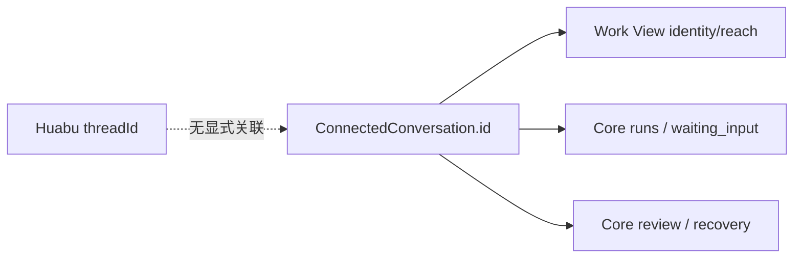

# Huabu ChatPanel → LCOS Conversation Work View 审计

日期：2026-09-14
范围：`frontend-reconstruction-v2`，只审计 T4/T7 对话缝合与 T3 Action Arc 覆盖；不改 projection、camera、backend continuation，不提交、不 push。

## 结论

当前迁移是 **PARTIAL**，不能诚实地标记为 Wave 8 已完成：`ConversationWorkViewBody` 只有 Core 的 identity/reach、Run/WaitingInput、Review、Recovery 区块，没有消息列表、输入、stream、history 或 session。Huabu 原 `ChatPanel` 的 transport/session 机械可以复用，但仓库里没有把 Huabu `threadId` / `ownerCanvasId` 唯一映射到 Core `connectedConversationId` 的真实 producer 或反查接口。因此本轮不挂旧 `ChatPanel` 壳，也不造假输入框和 UI 映射表。

## 现状链路

```mermaid
flowchart LR
  A[PreviewWorkspace] --> B[ChatSession]
  B --> C[ChatPanel]
  C --> D[useAgentStream / useChatHistory]
  D --> E[chatStore keyed by threadId]
  E --> F[Huabu /agent/history|stream|stop/:threadId]

  G[Core projection] --> H[ConnectedConversation.id]
  H --> I[GlythNodeBody]
  I --> J[ConversationWorkViewBody]
  J --> K[Core Work View aggregate]
```

现有 Work View 的链路只读 Core `connectedConversationId`，没有进入 `threadId` 对话链：



## 已核对的 Huabu seam

| 文件 / symbol | 真实职责 | 可复用边界 |
|---|---|---|
| `huabu/apps/web/src/components/Panels/ChatPanel/index.tsx::ChatPanel` | 旧右栏视觉壳；组合消息、输入、Agent/ACP 选择、权限和 review 卡 | 视觉不能直接搬进 LCOS；其 hook/store 调用是 transport 入口 |
| `huabu/apps/web/src/hooks/useAgentStream.ts::useAgentStream` | 以 `session.threadId` 调 `agentApi.streamThread/stopThread`，写 `chatStore`，处理 stream event、retry、waiting/tool 状态 | T7 transport 机械可复用，但只接受 `ChatSession`，不识别 Core id |
| `huabu/apps/web/src/hooks/useChatHistory.ts::useChatHistory` | 以 `threadId` + owner canvas 拉 history/reconnect，并将消息写回 `chatStore` | 需要真实 session producer；不可用 Core label/title 猜 thread |
| `huabu/apps/web/src/hooks/useChatSession.ts::ChatSession` | `{threadId, canvasId, ownerCanvasId, conversationView}` 的 Huabu session identity | 当前是 Huabu node/session 语义，不是 Core `ConversationView` |
| `huabu/apps/web/src/store/chatStore.ts` | 按 `threadId` 保存 messages/draft/loading/binding/settings | 不应在 Work View 复制一份 store |
| `huabu/apps/web/src/store/conversationOwner.ts` | `conversationViewForNode`、`conversationRequestScope`、owner 校验 | 只解析 Question node 的 Huabu owner |
| `huabu/apps/web/src/components/Panels/PreviewWorkspace/PreviewRenderer.tsx::questionSession` | 从 Question node 的 `conversationOwner.threadId/canvasId` 生成 `ChatSession` | 没有 Core `connectedConversationId` |
| `huabu/apps/web/src/components/Panels/PreviewWorkspace/PreviewWorkspacePanel.tsx` | 空 workspace 以 `createId('thread')` 创建 native chat target | 该 thread 没有 Core receiver 记录 |

## Core 映射审计

`packages/contracts/src/receiver.ts::ConnectedConversationV1` 只有：

```ts
{ id, projectId, provider, executorId, conversationRef,
  conversationSessionId?, label, isRunning, waitingReason,
  lastActiveAt, workspaceRef, branchRef, createdAt, updatedAt }
```

它没有 `threadId`、`ownerCanvasId` 或 Huabu `ConversationView`。`packages/contracts/src/conversation-identity.ts` 要求显式链路：

```text
ConnectedConversation.conversationSessionId
  ↔ ConversationSession
  ↔ conversationArtifactId
  ↔ conversationViewId
  ↔ Conversation Glyth
```

`apps/local-core/src/conversation-identity-service.ts::resolveChain` 和 `conversation-work-view-projection-service.ts` 都只消费这条 Core 显式链路；`ConversationWorkViewAggregateV1` 也只投影 identity/reach/contentStatus/runs/operations，没有 live Huabu messages。`apps/web-gen2/src/spatial/projectToSpaceProjection.ts` 创建 conversation node 时只写 label，再写 ProjectionBinding 的 Core `entityId`；`huabu/apps/web/src/lcos/nodes/GlythNodeBody.tsx::openWorkView` 将该 `entityId` 原样打开为 Work View target。

已排除以下不安全等同：

* `threadId == connectedConversationId`：无 producer、无合同声明。
* `threadId == conversationRef`：Huabu `/agent/*/:threadId` 路由和 Core receiver 的 external ref 没有接线证据。
* 用 title/provider/time 或最近记录反查：`conversation-identity` 明确禁止 heuristic。
* `conversationView == Core ConversationView`：前者是 Question node owner view，后者是 Core projection identity。

## 精确 GAP 与最小 unblock 字段

**GAP-CHAT-1 — 关联 producer 缺失**
文件/调用：`apps/web-gen2/src/host/projectionFacade.ts::projectConversations` → `apps/web-gen2/src/spatial/projectToSpaceProjection.ts::createEntityNodeUnlocked` → `GlythNodeBody::openWorkView`。现有调用链只传 `ConnectedConversation.id`。

最小字段由 Core/T7 runtime owner 产出（UI 不拥有）：

```ts
{
  projectId: string;
  connectedConversationId: string;
  threadId: string;
  ownerCanvasId: string;
  provider: 'codex' | 'workbuddy';
  executorId: string;
  conversationRef: string;
}
```

其中 `threadId` 与 `ownerCanvasId` 必须来自真实 Huabu session/owner 生产过程，并通过显式关联持久化；不能由 UI 从标题或节点位置推导。

**GAP-CHAT-2 — transcript read 缺失**
文件/调用：`ConversationWorkViewBody.tsx::ConversationWorkViewBody` 目前只能拿 `ConversationWorkViewAggregateV1`。要渲染 MessageList，需要 Core 提供 canonical transcript/timeline，或提供已显式关联的 `conversationSessionId` 加 read endpoint；owner 应是 Core Conversation/Import，不是 `chatStore` 的第二份真相。

**GAP-CHAT-3 — Work View adapter 未建立**
待 GAP-CHAT-1/2 成立后，才可在 `ConversationWorkViewBody` 相邻的新增 adapter 文件中把 Core 关联转换成唯一的 Huabu `ChatSession`，然后复用 T7 的 stream/history/retry/waiting_input 机械。adapter 不应挂 `ChatPanel`、复制 `chatStore`、再造 transport 或绕过 Core receiver。

## 用户可见影响

从 Glyth conversation 节点打开的 LCOS Work View 当前能看身份、可达性、Run/等待输入、review 和 recovery；不能在 Work View 看历史消息、输入 prompt、发送 stream 或 retry。原生 `ChatPanel` 仍只在 PreviewWorkspace chat tab 工作。Wave 8 账本行已修正为 `PARTIAL`。

## Action Arc 覆盖核对（只报告）

没有编辑 `apps/web-gen2/src/interaction/nodeCommandModel.ts` 或 `huabu/apps/web/src/lcos/navigation/LcosActionArc.tsx`。现有停挂旧工具条的六类是 `note/image/video/audio/canvasRef/nodeRef`，`ARC_SURFACES` 与旧 `NodeFloatingToolbar` 实码对照如下：

| 节点类型 | Arc 已覆盖的原节点命令 | 仍缺/保留旧壳 |
|---|---|---|
| `note` | 类型切换、accent、size、open large、move、auto-height、delete | 无本轮新增缺口 |
| `image` / `video` | accent、size、open large、move、delete | 无本轮新增缺口 |
| `audio` | accent、size、move、delete | 旧壳的 open-large 本就不存在 |
| `canvasRef` | open target、delete（绑定 Core 时显示真实禁用原因） | 旧壳能力已按实际控件收敛 |
| `nodeRef` | open、accent、size、delete；绑定时 compose/assembly/reference | move/open-large 不在旧壳该类型真实控件内 |
| 表外 `pdf/office` | 无 Arc 代理 | 下载等旧 action 未迁，继续挂旧壳 |
| 表外 `web` | 无 Arc 代理 | 外链 action 未迁，继续挂旧壳 |
| 表外 `sketch` | 无 Arc 代理 | 笔触颜色/粗细未迁，继续挂旧壳 |
| 表外 `question` | 无 Arc 代理 | AI run/cancel/replay 未迁，继续挂旧壳 |
| 表外 `frame` | 无 Arc 代理 | 容器布局/网格/解组未迁，继续挂旧壳 |
| 表外 `text` | 无 Arc 代理 | 原生字号/格式未迁，继续挂旧壳 |

这符合当前 fail-close 规则：表外命令没有假装成 LCOS GAP 按钮，先保留真实旧能力。

## 验证

| 命令 | 结果 |
|---|---|
| `npm run typecheck --workspace @local-creative-os/web-gen2` | PASS |
| `npm run test --workspace @local-creative-os/web-gen2` | PASS（276 tests） |
| `npm --prefix huabu/apps/web run typecheck` | PASS |
| `npm --prefix huabu/apps/web run test -- --run src/hooks/chatSessionIsolation.test.tsx src/hooks/useChatHistory.test.tsx src/components/Panels/ChatPanel/ThreadChatInput.test.tsx src/store/conversationOwner.test.ts` | PASS（4 files / 22 tests；测试输出有预期的 localhost:3000 连接拒绝日志，退出码 0） |

本轮没有新增代码测试：映射缺失时新增 adapter 测试会把不存在的能力伪装成已接通；现有 thread isolation/history/owner、Work View generation guard、Action Arc command model 测试已覆盖可验证边界。

## 回滚与下一步

本轮只有本审计文档与 `HUABU_RETIREMENT_LEDGER.md` 一行标签修正；回滚即恢复该行原文字，不涉及运行时代码、schema、迁移或数据。下一步必须先由 Core/T7 提供并验证 GAP-CHAT-1/2 的显式 producer/read contract，再做最小 adapter 和 Work View 消息/输入测试。
