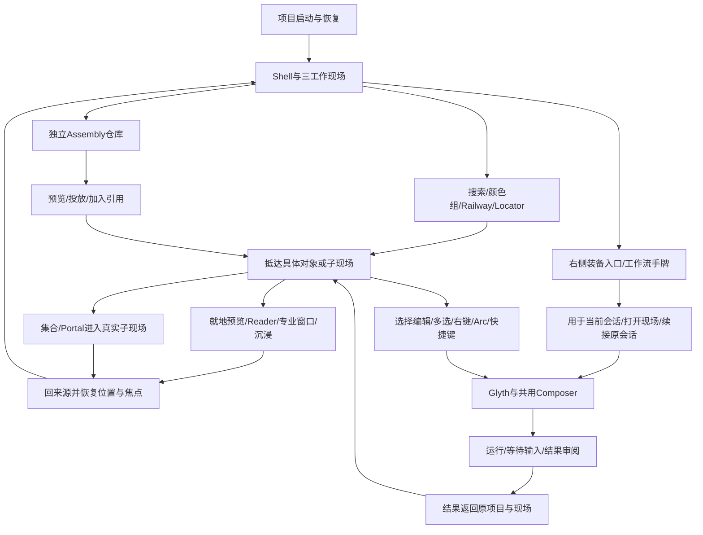

# GEN2 UX 框架总图与全旅程补漏

## 结论与范围

此前五项是用户指出的重点，不是完整框架清单。本次按完整采用清单的 15 个产品面、九面收口规格及用户最新要求，补齐跨页面操作关系。这里只补规划和审计目录，不修改产品代码、不新造功能、不宣布全 UX 已完成。

“原规划有方向”“具体规则未核清”“源码未完成”“本轮未验证”分别记录。未验证不能写成没实现；找到旧卡后应沿用，不能重开产品设计。

## 依据

- `E:/Codex 项目/OS开发/exports/LCOS_Figma_全设计包_20260913/LCOS_Figma_前端施工完整采用清单_20260913.md`：前部15产品面、第3节合并裁决、第4节残余缺项、第5节组合检查。
- 同目录 `LCOS_Figma_九面视觉统一收口交付_20260913.md`：九面操作去向、恢复、响应式和最小缺项。
- 本仓 `docs/audit/GEN2_全前端UX_Figma总表对照_20260914.md` 与 `GEN2_UX纠正汇总与Chat美化交接_20260914.md`：前轮源码和实点证据。历史状态不自动代表今天仍未改。
- 用户最新明确的右侧装备/沉浸预览悬浮栏：作为当前要求；精确旧Figma节点尚未定位，不声称历史来源已经核实。

## 完整框架目录

|编号|框架|原有方向／当前要求|还必须核清或施工到的连接|
|---|---|---|---|
|01|项目进入与恢复|项目启动页→项目→原工作现场|新项目空态、打开失败、切项目后的目标/草稿归属、重载恢复现场；有原规格，本轮未全测|
|02|全局入口布局|顶部Navigator、左弹性Railway、底部三现场；右侧装备/沉浸入口；Assembly独立|右侧栏旧稿定位；各入口显隐和空间避让；临时按钮不得追认为设计正本|
|03|查找与抵达|搜索未知对象、F查当前对象位置、颜色组、画外Locator|结果→正确现场→目标聚焦；多位置如何选；Rail接收/重排/溢出；当前搜索可输入不等于全导航完成|
|04|画布基础编辑|选择、多选、编辑、拖动、缩放；保留Huabu机械|逐项核复制粘贴、撤销重做、删除、连线、框/组等旧能力是否采用及新入口；右键/Arc/快捷键共用动作，不能凭名称添加新命令|
|05|对象形态与远中近|材料直接呈现；集合/Glyth/任务卡各有家族；LOD不改身份|远景仍可辨认、近景可编辑、选择后动作正确；不把语义节点全部白卡化；本轮未穷举物种|
|06|跨区域拖放与引用|同身份投影，已有投影定位；装配供料，引用先入草稿|源×目标动作矩阵：材料/集合/卡/Glyth→Main/Context/Workflow/Composer/Rail/窗口；失败回原处、重复拖入、批量部分成功。原清单明确矩阵未齐|
|07|集合与子现场|集合可在Atlas/Assembly/Main表达；Portal复用预览、进入和返回|成员与表征分开；事情/时间来源；进入真实可编辑child；返回相机和选择；不能用定位代替进入|
|08|工作流装备与取用|手牌/卡池是选择层，Workflow是真实现场|轻预览、用于当前会话、打开现场、续接原会话三动作；目标反馈；Main无需先造任务牌节点；任务卡来源不能拿普通材料代替|
|09|阅读与窗口|就地预览、Reader、专业窗口和用户要求的沉浸模式分层|正文/媒体、摘录/引用/返回；float/dock/split/tab/resize；阅读缩放与画布缩放分开；沉浸如何进入/退出需对旧稿|
|10|会话与输入|Glyth、原Huabu会话、Work View、Composer贯通|会话身份/历史映射；接收者切换、引用替换移除、草稿保留、发送目标；不是只复用一个输入组件就算融合完成|
|11|执行与结果返回|Run→等待→结果→审阅→采纳/重试/恢复跟随原对象|从哪个入口看进度、离开后如何回来、结果落在哪、未知结果避免再次发送；已有部分后端和body，本轮未验证完整provider链|
|12|全局焦点与临时层|Esc逐级退出、Tab可见焦点、窗口前置、不压缩真实坐标|搜索/右键/Arc/Composer/手牌/Atlas/Reader同时存在时的层级、点击空白与关闭后的焦点；需要组合核验|
|13|布局记忆与异常恢复|重载恢复合法目标/窗口/阅读位置；不重复创建|相机、选中、窗口组、Rail顺序、草稿各自归属；缺文件/目标失效/断线就地反馈；Context当前异常不能用重建掩盖|
|14|全局辅助与宿主边界|系统项归项目菜单；外部能力渐进披露|设置/帮助/连接状态原入口逐项核；窄宽、触控、键盘、reduced-motion不删功能。Browser工作组增强仍按用户要求暂缓|

14项是本轮审计目录，不是14个全新模块，也不是已穷举所有按钮。覆盖对象是原15产品面及它们之间的连接。

## 产品旅程总图

图只表达产品去向，不指定新增store、路由、服务或UI组件。

## 施工前逐项补齐的最小说明

每项把六个答案放在一起：入口在哪、出现什么、对哪个对象操作、成功后去哪、失败怎么保留现场、如何退出/返回。再附原卡/Figma来源、当前组件入口及未验证项。找得到原答案就链接并保留内容，不压缩成“参考T1/T5”。

先核04/06/07/12/13这些跨域规则，同时补02右侧栏来源；它们会影响多个页面，不能各路自由发挥。再按区域施工并真实点击一条往返链。视觉细化只交给已核清的区域；不能用“全Wave完成”替代逐项实际状态。

## 这次做了什么

### 分项源码核对回传

- [入口导航原案](GEN2_入口导航原案核对_20260915.md)：定位旧沉浸取材5046:66、小精灵能力装备5046:67；不把它们直接等同全局右栏或工作流手牌。导航组件存在，但ColorPin producer、Locator呈现、Rail接收与排序缺口仍在。
- [拖放与现场往返](GEN2_拖放与现场往返核对_20260915.md)：区分Assembly按钮apply、语义拖放预览与Huabu原生导入；集合/Portal/卡片缺完整目标进入返回。注意局部链的缺失不能推广成所有文件拖入不可用。
- [原画布命令与浮层](GEN2_原画布命令与浮层核对_20260915.md)：右键菜单未核到生产实现；快捷键和内核仍在，Arc只覆盖部分类型；绑定节点删除入口差异需实测。逐级Esc需要行为证据，不等于要求新增平台。
- [阅读窗口与项目归属](GEN2_阅读窗口与项目归属核对_20260915.md)：Reader主体仍缺正文；现成PreviewWorkspace机制可复用；窗口布局与项目归属有待补齐。

下一批顺序：先验证并统一同一操作的目标身份（删除/投放/切项目），再接预览与进入返回的已有机械，然后整理右侧和全局命令入口，最后逐区域交给Chat美化。先完成一个来源→动作→结果→返回闭环，再扩到其它对象；不重复“全部Wave完成”的笼统结论。

读取原清单前部产品账本和九面操作规格；扩展框架目录及旅程图。没有修改源码、运行测试、提交或推送。后续仍需逐项回查原卡和代码，不能把本文件当成完成验收。
