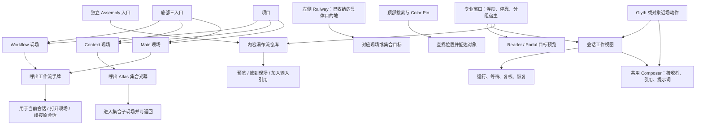

# GEN2 全前端 UX：Figma 总表对照与纠偏地图

> 2026-09-15 补充：跨页面框架与完整旅程目录见 [UX框架总图与全旅程补漏](GEN2_UX框架总图与全旅程补漏_20260915.md)。此前五项用户提示不是完整缺口清单；本页保留历史审计状态，后续纠正记录不能据此倒退。

日期：2026-09-14。范围：界面角色、形态、入口、操作关系；本轮不修改运行时代码。

## 结论

现有规划足以确定主要 UX 结构，无须把产品重新设计一遍。当前实现存在三类不同问题：已经有合理骨架但尚未完整、界面形态或对象语义做错、运行现场暂不可用。三类不能混报为“未接数据”。

本轮最明确的形态偏差是 Assembly、Atlas、Workflow 手牌；最明确的入口偏差是 Action Arc 与共用 Composer；窗口和 Reader 则仍缺主要使用形态。下面是第一轮全产品梳理，不是全部状态验收。

## 采用依据

- [完整采用清单](<E:/Codex 项目/OS开发/exports/LCOS_Figma_全设计包_20260913/LCOS_Figma_前端施工完整采用清单_20260913.md>)：前部 15 个产品面、必须保留裁决、各页来源。
- [九面视觉统一交付](<E:/Codex 项目/OS开发/exports/LCOS_Figma_全设计包_20260913/LCOS_Figma_九面视觉统一收口交付_20260913.md>)：当前主构图及入口规格；覆盖总表旧的笼统 NEEDS_FIGMA 描述，但不代表全部状态已画。
- [集合、取用、Portal 专项](<E:/Codex 项目/OS开发/exports/LCOS_Figma_全设计包_20260913/adoption/GEN2_Figma_集合跨视图与工作流取用_实际交付_20260911.md>)：第 13 页 A/B/C/P 操作链。
- [外部入口专项](<E:/Codex 项目/OS开发/exports/LCOS_Figma_全设计包_20260913/adoption/GEN2_Figma_T7前端入口_视觉交付与T5回传包_20260911.md>)：共用输入、接收、等待、恢复；不能覆盖早先整个产品。
- 用户本轮纠正优先：Railway 随接入目的地增长；Assembly 保持瀑布流且独立入口；承接与提示词共用输入；Assembly 不放节点 Arc；先梳理再施工。

本轮查看了 8 张九面主图及 Assembly、手牌、取用卡等局部图，读取相关当前组件，并在 5273 实点 Main、Assembly、Context、Atlas、Workflow、Card Pool。没有穷举 1,369 项顶层节点和所有交互状态。

## 产品地图

三个现场各自保留工作位置和操作状态。Atlas、手牌是呼出表征；专业窗口承载内容。共用能力不意味着把这些东西都画成同一种面板。

## 全量产品面第一轮对照

| 产品面 | 应有样子与入口关系 | 本轮发现与判定 | 后续纠正方向 |
|---|---|---|---|
| 项目启动 / Shell | 项目封面入口；进入项目后是内容优先的轻壳；项目菜单承接系统项 | 项目启动组件存在，完整启动页尚未完成本轮目视核验；当前 Shell 可保留骨架 | 不把诊断、执行配置铺成主导航；核对启动主稿 5388:3652 |
| Main | 白底轻点阵，材料直接呈现；图片、文字、文档、音频、集合、Glyth各有形态 | 当前首屏 32% 缩放，多对象显示缩略白块；不能仅由远景认定所有近景物种丢失。关系英文标签明显偏工程展示 | 按远中近分别检查；内容形态和对象操作统一，不能靠固定摆放复刻示例 |
| Context | 自由操作的真实现场；集合子画布也是真实工作现场；进入后能返回原处 | 实点显示 Space 不存在，故正常现场待验证 | 保留身份与返回关系，不能用 Atlas 管理页代替现场 |
| Workflow | 真实材料、任务、过程、结果的工作现场；有 region/child 两类进入 | 实点同样显示 Space 不存在；正常现场待验证 | 不压成固定步骤表或 DAG 编辑器；卡牌选择层与现场分开 |
| Atlas | 在当前 Context 背景上呼出规整体块光幕；事情/时间图标区分；同一集合可压缩投放到 Main | 实点为带外框的大管理面板，分组标题 SCENE/CONVERSATION，白卡写“总览”；形态与组织语义均偏 | 恢复集合体块、背景连续性与原位焦点。事情不能等同数据库 kind，时间不能仅凭 updatedAt 冒充完整组织 |
| Temporal Rail | Context 子现场右侧局部刻度；固定密度、hover 内凸/鱼眼、wheel 时间窗、多对象定位 | 当前只看到“暂无时间记录”空态；不能据此判正常刻度完成或错误 | 空态可保留诚实反馈；正常态按 5156:504/1871/3249 与 5388:25701 对照 |
| Assembly | 独立项目仓库入口；内容瀑布流、图片/文字直接预览；悬停/选中再显动作；可搜索筛选 | 实点为等高双列卡，每张常驻草稿/阅读/投放，图片没有预览；确定形态偏差。源码确为 grid-cols-2 | 按 5202:369 的内容布局与 5346:1416/1666/1885 的最新专项恢复；旧图烟灰材质不回流 |
| Professional Window | 内容宿主；浮动、拖动、resize、停靠、分组/tab；窗口与装配概念区分 | 当前所有 body 都挤进固定右侧 520px 单活动容器；可保留关闭/tab骨架，窗口能力明显未齐 | Reader、Assembly、会话有各自入口与适宜尺寸；共享 Chrome 不等于共享固定宽度 |
| Reader | 正文/媒体为主体，支持阅读组、tab与返回来源；局部预览和完整阅读分层 | 当前源码主体是元数据和“外部打开”文字；外部打开为 span，非真实按钮；属于主要内容缺失 | 恢复正文与媒体各自表达；不可把提示文字当已提供打开能力 |
| 运行 / 复核 / 等待 / 恢复 | 跟随原会话、原操作，在工作视图或近场出现；异常时就近说明 | 工作视图已有 Run、Waiting、Review、Recovery sections；本轮未重跑真实 provider 链 | 保留这些业务承接，降低工程字段的可见比重；不能让状态列表替代完整会话体验 |
| Composer / Receiver | 同一输入体系：当前接收者、引用预览、提示词、发送；近场与工作视图共用；切换保留草稿 | 静息无底部常驻输入已符合方向；近场 Composer 与工作视图尚未整合，后者源码没有 Composer | 承接/续工和正常输入在同一会话体验里分层展开；普通发送不常驻 provider 配置 |
| HUD / Railway / Navigator / Locator | 底部三现场；左侧目的地随数量生长；顶部搜索+已用颜色组生长；画外定位独立表达 | 假三按钮 Rail 已移除，但当前没有可用 Rail 项，接收/drop与目的地进入仍未完成；搜索仅覆盖部分定位 | 空 Rail 不等于完成。搜索、查当前对象、颜色组、画外指路各有职责；不能统一成一个搜索框就算齐 |
| Glyth | 会话的空间角色，近场输入与打开工作视图；续工/分支/新建按能力表达 | 已有呈现组件及会话工作视图；Huabu thread 到 Core 会话映射仍有审计缺口；完整交互待验证 | 同一会话贯通；不能再造第二个聊天框、第二套历史或让用户辨认两个系统 |
| T7 入口 | 分布在接收者、输入、装配、来源和工作视图中 | 有部分运行/恢复承接；本轮不重新判后端完成度 | 保留渐进披露，不建立“T7中心”；不能用增量页替代全产品 |
| Browser / Desktop | 原设计为宿主预留；浏览器工作组方案用户已明确暂缓 | 不属于本轮主界面补齐范围 | 保留后续入口位置记录，不为追求全覆盖插入空按钮 |

## 需要单独讲清的六组关系

### 1. Railway、搜索岛和底部三入口

底部切 Main/Context/Workflow。左侧收纳的是用户需要反复回到的具体目的地；接入一个长一点，继续接入继续增长，能够重排和辨认。顶部搜索用于找内容，颜色组用于找已组织的一组内容。三个东西不能相互顶替。

Figma 来源：5388:27696、5384:367、5385:283。示例四枚图标不代表永久四个按钮，也不能把根现场自动塞进去。Gen1可参考目的地、排序和预览交互，但旧缩略图视觉已被后续设计纠正。

### 2. Assembly 与专业窗口

Assembly 是“拿材料的地方”；专业窗口是“承载阅读、装配、会话等内容的窗口能力”。仓库要有明确独立入口；阅读/会话由对应对象进入，已打开窗口可返回。不能用一个“专业窗口”按钮要求用户再猜里面是什么，也不能把仓库藏在每个节点的 Arc 里。

当前临时顶左 Assembly 入口只证明独立可达，最终位置和图标应对照原主稿明确标签，不把临时摆放追认为 Figma 定稿。

### 3. Action Arc、承接与提示词

Arc 贴当前对象右上角，放少量该对象动作与“更多”。用户已纠正 Assembly 不应作为节点主动作。Glyth 的会话入口、续工选择、接收者、引用和提示词需要形成一条连贯体验；不拆成两个互不认识的输入流程。

“共用 Composer”不等于只能放在专业窗口里：Figma 5388:96 有近场输入，12页 A10有工作视图中的同一输入体系。两处应保持同一目标、草稿和引用。续工模式可以展开，但不需要再造一套提示词框。

当前 nodeCommandModel 与 LcosActionArc 仍有 assembly 命令；Arc 仅在 composerOpen 时隐藏，窗口遮挡关系未完整处理。后续应统一处理选择态、近场动作、窗口前置和逐级 Esc。

### 4. 集合、Atlas、Portal 与真实子现场

同一上下文集合在 Atlas 是有体量感的文件夹/体块；放到 Main 仍保留这套家族特征，可压缩或伪 2.5D，不能变成无差别小条目。Assembly 中保持内容瀑布流，并用事情/时间两类图标辨认集合。

Portal 提供目标预览、局部放大、进入和返回；集合与工作流可以复用进入/返回能力，但不因此全部变成 Portal 对象。Context 子画布不是只读预览页。

当前 PortalPreviewBody 主要显示 target 身份，尚不是真实目标预览；不能把“有 target 字符串”当作进入或预览已完成。

### 5. Workflow 现场、手牌、卡池与取用

手牌是游戏装备卡式选择表征；卡池是更多卡与搜索；工作流现场是进去工作的地方。Main 也能直接呼出工作流卡，不要求先把卡变成 Main 节点。

取用卡要区分“用于当前会话 / 打开现场 / 续接原会话”。加入引用只是草稿变化，发送才开始执行。普通材料可以作为引用，但不能因为 warehouse 有材料就把它们统统包装为工作流任务牌。

当前 Card Pool 把 artifact/conversation/workflow一起过滤成统一竖卡，实点没有封面，仅显示“artifact · 卡牌（3:4）”；这是产品表达偏差，不是缺几张图片而已。

### 6. Huabu 原有编辑与右侧会话

画布选择、编辑、拖动、撤销、缩放、媒体预览等能力要留，按 LCOS 的节点、Arc、菜单、Reader 和专业窗口组织。不能保留两套竞争入口，也不能为了去掉旧按钮先把功能摘掉。

右侧会话应融入 Glyth/会话工作视图/共用 Composer。此前子代理已核到 Huabu thread 与 Core connectedConversation 的映射缺口；本轮只登记 UX 结果：用户应操作同一个会话，而不是先学会辨认 Huabu 聊天和 LCOS 聊天。

## 来源中仍要核清的点

- 九面文档 Context 一节写“Atlas不是Canvas overlay”，而总表及原始裁决称呼出层，当前主图也保留透出的 Context 背景。这里存在用词冲突：产品上按用户确认的“现场中的呼出表征、可收回、子现场真实可编辑”理解；技术挂载方式本轮不裁决。
- 九面窗口稿给双窗口、分组/tab方向，具体停靠/拆组完整状态图尚不齐。不能用缺完整图否定现成方向，也不能声称已全状态定稿。
- 集合事情/时间的真实组织来源、工作流卡的合法来源及无来源时的表现仍要对原卡核清。不能用数据库 kind/更新时间自行替代。
- Color Pin、Railway接收/重排/溢出、Locator连续形态、全域Drop矩阵、完整motion仍有局部待核；不应笼统归为整个面“未设计”。

## 下一轮应该按什么顺序看

1. 先一次性摆正全局入口：三现场、弹性Railway、搜索岛、Assembly、已打开窗口、对象近场输入的相互位置。
2. 再把最明显的三种形态恢复：Assembly内容瀑布流、Atlas集合光幕、Workflow手牌与卡池。可先用真实现有数据的有限状态，缺的数据如实留空。
3. 核通对象→近场Composer/会话工作视图→等待/复核，以及对象→Reader、集合/Portal→子现场→返回的操作关系。
4. 最后统一远中近、窗口避让、Esc、拖放反馈和窄宽。精细材质与动画在形态/关系正确后再磨。

每块只需要回答：用户从哪里进、眼前是什么、能做什么、动作后去哪里、怎么回去。来源中已有答案的直接沿用，缺的标具体问题，避免让施工者再发明一版产品。

## 本轮现场与交付边界

当前分支 frontend-reconstruction-v2，读取时 HEAD ef4c214；工作区已有大量未提交修改，本轮保留原状，只新增本报告。没有提交、推送、重建画布、改数据库或运行完整测试链。

实点初次Main可见；切到Context、Workflow均提示Space不存在，再切回Main也出现同样提示。此现象作为现场可用性问题记录，尚未定位原因，不能据此推断三现场源码全无，也没有点击重建来掩盖它。

本报告是产品面第一轮UX梳理。Assembly/Atlas/Card Pool的形态偏差有当前截图和代码双重证据；Reader/WorkView/Portal主要依据代码；项目启动完整视觉、正常Context/Workflow、全部快捷键与真实执行流程仍未完成本轮实测。没有给出虚假的“全UX验收通过”。
