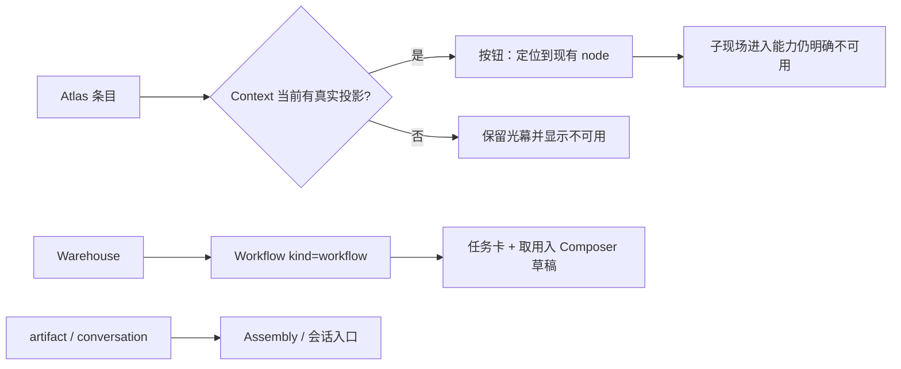

# GEN2 Context / Workflow UX 纠偏交接

日期：2026-09-14
范围：`huabu/apps/web/src/lcos/surfaces/context`、`huabu/apps/web/src/lcos/surfaces/workflow`

## 结论

已完成一轮结构与操作纠正：Atlas 只接 `context / collection / scene` 三类真实集合/现场条目；conversation/workflow 不再塞入 CollectionSurface。Atlas 不再按实体 `kind` 冒充“事情”分组，也不再把 `updatedAt` 包装成时间组织；当前没有明确组织字段，因此两种组织控件均禁用并给出原因，条目归入“未指定组织”的中性容器。没有真实投影的 Atlas 条目不会点击后只关闭面板，而是明确显示当前现场不可用；已投影条目动作叫“定位”，不冒充子现场进入。Workflow 手牌/卡池只呈现真正的 `workflow` 条目，普通 artifact/conversation 继续由 Assembly / 会话入口承接。

## 变更流程

旧路径是 Atlas 卡片按 `kind` 生成 SCENE/CONVERSATION 等管理分栏，点击回调最终只关闭 Atlas；Workflow 将 artifact、conversation、workflow 统一渲染成任务卡。新路径只允许已有真实定位能力的条目进入 Context 当前画布，并把素材、会话、工作流保留在各自入口语义内。

## 修改文件

- `huabu/apps/web/src/lcos/surfaces/context/ContextAtlasStage.tsx`
  - “事情”改为单一事项体块，不按 kind 分栏。
  - 时间切换禁用并说明“当前数据没有明确的时间组织字段”；`updatedAt` 仅作为卡片事实显示。
  - 未指定组织字段时统一显示“未指定组织”，不把所有条目默认叫事情。
  - 仅允许 context / collection / scene 进入 Atlas；未知组织使用中性容器，不挂 CollectionSurface 的事情轴。
  - 事情 / 时间控件均禁用；Atlas 复用 `useCloseOnEscape`。
  - 只为已投影实体提供定位动作；无投影显示“当前现场不可用”。
  - Atlas 光幕保持 Context 背景连续的轻量体块布局。
- `huabu/apps/web/src/lcos/surfaces/context/ContextWorksite.tsx`
  - Atlas 进入动作改为 `requestLocate`，绑定真实 nodeId / canvasId。
  - 找不到当前 Context 投影时返回 `false`，不关闭 Atlas、不冒充进入成功。
- `huabu/apps/web/src/lcos/surfaces/workflow/WorkflowCardPool.tsx`
  - 卡池只加载 `kind === 'workflow'`。
  - 卡面文案明确为工作流装备卡；artifact/conversation 不再伪装任务卡。
  - 空态为“还没有工作流卡片”，不泄漏未接通的提炼入口。
- `huabu/apps/web/src/lcos/surfaces/workflow/WorkflowWorksite.tsx`
  - 导出 `WorkflowHandOverlay({ projectId, open, onClose })`，Main 可直接复用呼出层，不复制 Canvas / store truth。
  - 手牌复用既有 `useCloseOnEscape`，Esc 关闭 overlay 并阻止事件继续清空画布选择。
- `huabu/apps/web/src/lcos/surfaces/context/contextAtlasSemantics.ts`、`workflow/workflowCardSemantics.ts`
  - 抽出纯语义判断，供行为测试与生产 caller 共用。

## 用户操作变化

- Atlas 中没有 Context 当前投影的对象不可点击，并会看到原因；用户不会被带到空现场。
- Atlas 中已投影对象点击“定位”会向唯一 Huabu camera pipeline 发请求。
- Workflow 手牌搜索只搜工作流；取用仍只改变 Composer 草稿，不自动执行。Main 可复用 `WorkflowHandOverlay`。
- Workflow 的打开/续接能力仍未接入，现有“打开（尚未接入）”保留为诚实提示。

## 数据流 / owner

- Warehouse 仍由 Core `getWarehouse(projectId)` 提供，没有新数据表或本地副本。
- Atlas 投影判断读取 `useLcosReferenceStore.nodeEntityRefs`；定位通过 `useLcosShellStore.requestLocate`，由既有 `LcosCanvasCommands` 消费。
- 工作流卡取用继续调用 `useLcosReferenceStore.addEntityToDraft`，不复制实体、不启动 Run。

## 验证

- `npm run typecheck:web-gen2`：通过。
- `npm run test:web-gen2 -- --run`：通过，276 tests / 0 failed。
- `pnpm exec eslint apps/web/src/lcos/surfaces/context/ContextAtlasStage.tsx apps/web/src/lcos/surfaces/context/ContextWorksite.tsx apps/web/src/lcos/surfaces/workflow/WorkflowCardPool.tsx`：通过；仅有既有的 multi-project tsconfig warning。
- `npx vitest run apps/web/src/lcos/surfaces/context/ContextAtlasStage.test.ts apps/web/src/lcos/surfaces/workflow/WorkflowCardPool.test.ts`：通过，2 files / 3 tests。
- `pnpm --filter @huabu/web typecheck`：通过。
- 未执行真实浏览器截图回归：当前工作区已有大面积未提交改动，且本切片未启动本地服务。

## 风险与未完成

- Core warehouse 当前没有独立“事情/时间”组织字段，因此 Atlas 禁用时间切换，条目只保持“未指定组织”集合，不虚构领域分组。
- Atlas 对未投影 scene / conversation / collection 没有独立的跨现场进入 producer；已投影对象也只支持当前现场定位，子现场进入现在明确不可用，后续应接 Portal / Worksite navigation 后再开放动作。
- Workflow 打开现场、续接原会话仍是未接入能力；本次没有添加假按钮。
- 没有修改共享 UI families、Shell、Store truth、Schema，也没有删除既有能力。

## 回滚

本切片只涉及上述 3 个前端 surface 文件；可按文件级审查 revert。未创建 commit、branch 或 push。
