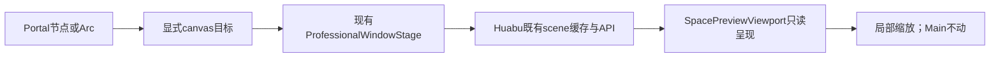

# Portal 真实预览：P01/P02 接线

## 原案对应

Figma集合跨视图与工作流取用专项：P01 `5350:1332` 只读预览；P02 `5350:1490` 局部放大、Main不动；状态族 `5348:1151` 六态。原说明要求复用SpacePreviewNode/useSpacePreviewScene/getSpacePreviewScene/openTarget相关机械，只补薄身份映射。

施工前来源核对见 `../audit/GEN2_Portal往返施工前原案对照_20260915.md`。该报告记录的是读取时状态，本交付更新其中P01/P02，不能据旧“只有字符串预览”结论倒退。

## 实际改变

原来：Portal→窗口→显示target字符串；target有值就称部分预览，无法查看真实内容。

现在：Portal canvas目标→同一专业窗口→既有useSpacePreviewScene缓存/API→既有SpacePreviewViewport。预览内显示实际scene节点、文本和媒体；缩放沿用donor本地viewport，不切换主canvas、不创建编辑graph。

窗口上下文新增可选targetKind=canvas。只有真实canvasRef入口传该类型；Assembly的实体ID不会被猜成canvas地址。目标未关联时明确不可预览，不再提示虚假的“已找到入口目标”。重复打开同类型同target激活已有窗口；不同地址类型不混用。新窗口使用UUID避免同毫秒创建窗口ID冲突（仅临时UI身份）。

状态来自实际snapshot：首次读取→加载中；有效scene→可预览；truncated→部分预览；保留旧scene且stale/error→旧缓存；无scene且错误→预览失败；404或无地址→目标缺失。已有缓存收到404后不继续展示成可用目标；旧缓存/失败支持原retry。

## 文件

- `huabu/apps/web/src/lcos/professional/PortalPreviewBody.tsx`及新增测试。
- `professional/ProfessionalWindowStage.tsx`透传目标类型。
- `shell/lcosShellStore.ts`及测试：目标类型与重复打开。
- `nodes/PortalNodeBody.tsx`、`navigation/LcosActionArc.tsx`：显式canvas来源。
- `ui/families/LcosPortalPreview.tsx`：失败/旧缓存/缺失的重试入口。

## 验证

- Portal body、Shell store、原SpacePreviewViewport三文件测试11/11通过。
- 使用真实donor viewport渲染测试，wheel改变预览viewBox，未调用主画布setViewport。
- 同target重复激活、实体ID不触发scene读取、真实六态映射与重试均有测试。
- 目标文件ESLint和Huabu typecheck通过；最后小改UUID与store测试后补跑相关测试通过。
- 尝试浏览器复核时CUA浏览器连接失败，未取得页面或截图。本批不声称浏览器/Figma像素验收通过。

## 未做与影响边界

P03–P06的工作流目标进入、提升装配/工作台、Context child进入返回没有因此完成。仍需canonical目标→child canvas映射和来源恢复规则；不能直接跳到旧Huabu路由或Context首页替代。没有新增后端服务、修改数据、重建画布或写入业务身份。previewNodeId仅用于donor局部预览偏好，不创建真实节点。

本批未提交/推送。回滚按上述文件本批diff选择性还原，保留其他施工改动和donor原文件。
