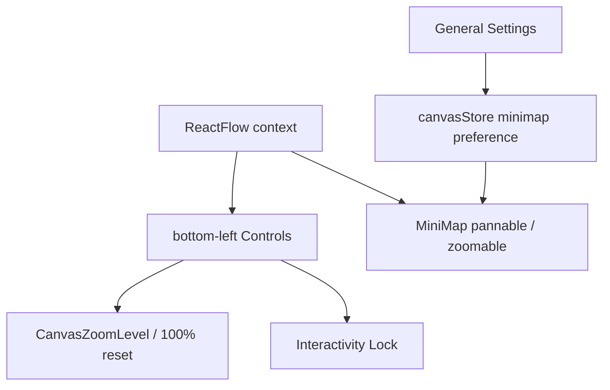
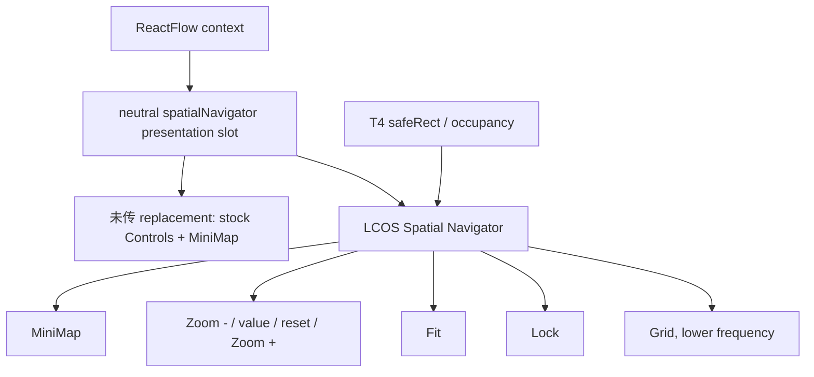

# LCOS Gen2 · T2 C2-3B Spatial Navigator Exact Source Blueprint

> 日期：2026-09-07  
> 文档状态：v2 颗粒度审计已通过；Production patch 未施工  
> Gen2 基线：`LCOS_Gen2/main@232b2ca5`  
> Huabu upstream 基线：`a3c411e1f655191344285141f08c4738fa6015f7`  
> 适用范围：Spatial Navigator 的 owner、挂载 seam、复用边界、测试与回滚  
> 禁止解释：本文件不授权修改 `huabu/`，不表示 T2/C2 已整体完成

## 1. 阶段结论

Spatial Navigator 不建立第二套 Camera、Minimap、Zoom、Fit、Lock 或 viewport state。它只是 LCOS 在 Huabu 既有空间机械之上的 presentation body。

最终 owner 固定为：

```text
Huabu / T1
├─ ReactFlow context
├─ viewport / Camera state 与执行
├─ MiniMap mechanics
├─ Zoom mechanics 与 100% reset
├─ Fit mechanics
├─ Canvas interactivity Lock
└─ per-canvas viewport persistence

T2
└─ Spatial Navigator presentation / information hierarchy

T4
└─ Work View occupancy / safeRect / navigator placement

T5
└─ 最终视觉、材质、间距、LOD 与 motion backfill
```

因此：

```text
KEEP
→ ReactFlow MiniMap
→ pannable / zoomable
→ Huabu viewport
→ per-canvas viewport persistence
→ CanvasZoomLevel mechanics
→ 100% reset
→ ReactFlow Controls zoom mechanics
→ CanvasInteractivityControl
→ canvasStore.minimapEnabled / toggleMinimap

ADD
→ LCOS Spatial Navigator presentation body
→ 一个中立、可选、ReactFlow-context 内的 presentation slot

DO NOT BUILD
→ NavigatorStore
→ MinimapStore
→ ZoomStore
→ CameraStore
→ FitStore
→ LCOS viewport persistence
```

## 2. Current source census

### 2.1 Canvas 与 ReactFlow owner

文件：

```text
huabu/apps/web/src/components/Panels/Canvas/Canvas.tsx
```

已核实符号与事实：

- `MiniMap`、`Controls`、`ControlButton`、`useReactFlow`、`useStore` 直接从 ReactFlow 侧消费；
- `CanvasZoomLevel` 读取 `state.transform[2]`，点击调用 `zoomTo(1, { duration: 200 })`；
- `CanvasInteractivityControl` 是成熟 controlled control，权威 lock state 仍由 Canvas 持有；
- `<Controls position="bottom-left">` 当前组合 Zoom Level 与 Lock；
- `<MiniMap pannable zoomable />` 当前直接位于 `<ReactFlow>` 内；
- `Canvas` 当前只接受 `shortcutsDisabled?` 与 `hostExtension?`，尚无 Spatial Navigator replacement slot。

裁决：`MiniMap / Controls / useReactFlow()` 依赖 ReactFlow context，Spatial Navigator 不得被搬到 Project Chrome 外再用跨层 callback 模拟这些能力。

### 2.2 Minimap preference owner

文件：

```text
huabu/apps/web/src/store/canvasStore.ts
huabu/apps/web/src/components/Settings/sections/GeneralSettings.tsx
```

已核实：

```text
MINIMAP_STORAGE_KEY = huabu.minimapEnabled
canvasStore.minimapEnabled
canvasStore.toggleMinimap
GeneralSettings 直接消费同一组 state/action
```

裁决：Spatial Navigator 只能消费这份 preference，不新增 LCOS preference，也不把 Minimap 可见性塞入 Core canonical truth。

### 2.3 Fit / bounds owner

文件：

```text
huabu/apps/web/src/components/Panels/CanvasLayerPanel/focusNodesOnCanvas.ts
```

已核实符号：

```text
getReliableNodeBounds()
fitNodesOnCanvas()
focusNodesOnCanvas()
```

`getReliableNodeBounds()` 已处理 `onlyRenderVisibleElements` 下 offscreen / unmeasured node 的可靠 bounds。`fitNodesOnCanvas()` 基于这套 bounds 调用 `rfInstance.fitBounds()`；`focusNodesOnCanvas()` 复用相同 bounds 并由 Huabu 执行 Camera。

裁决：Navigator 的 Fit action 必须复用 Huabu helper/instance，不复制 bounds 数学。

### 2.4 当前 LCOS seam

文件：

```text
huabu/apps/web/src/lcos-seam/types.ts
apps/web-gen2/src/integration/huabu/LcosCanvasAdapter.tsx
apps/web-gen2/src/host/hostSeam.ts
```

当前 `CanvasHostExtension` / mirror 只覆盖：

```text
nodeTypes
overlays
recognizers
connectIntent
```

尚无 `spatialNavigator` 字段。Spatial Navigator 不是普通 overlay：它需要 ReactFlow context、固定 HUD placement、与 stock Controls/MiniMap 的替换关系。把它伪装成任意 overlay 会模糊 owner 与占位规则。

## 3. 变更原因

LCOS 需要把 MiniMap、Zoom、Fit、Lock 组织成一个统一空间仪表，但不能破坏 Huabu 的 Camera/context/mechanics，也不能让 stock Huabu 被 LCOS presentation 污染。

当前分散形态：



目标形态：



## 4. Exact seam proposal

### 4.1 颗粒度审计修正

v1 候选的 `spatialNavigator?: ReactNode` 不足以直接施工。它只解决“在哪里渲染”，没有把 Lock、Fit 与 Minimap 的既有 owner 作为受控能力传给 presentation，施工者仍可能自行读写状态或绕过 reliable bounds。

v2 固定为 render-function contract：Huabu 生产只读状态与动作，LCOS 只决定排列和视觉。跨 seam 不暴露 `ReactFlowInstance`，也不传 mutable store。

### 4.2 Exact neutral contract

在 `huabu/apps/web/src/lcos-seam/types.ts` 新增：

```ts
export interface CanvasSpatialNavigatorControls {
  readonly zoom: number;
  readonly minimapEnabled: boolean;
  readonly interactivityLocked: boolean;
  readonly miniMap: ReactNode;
  readonly zoomIn: () => void;
  readonly zoomOut: () => void;
  readonly resetZoom: () => void;
  readonly fitCanvas: () => Promise<boolean>;
  readonly toggleInteractivity: () => void;
}

export type CanvasSpatialNavigatorRenderer = (
  controls: CanvasSpatialNavigatorControls,
) => ReactNode;

interface CanvasHostExtension {
  // existing fields unchanged
  readonly spatialNavigator?: CanvasSpatialNavigatorRenderer;
}
```

| 字段 | Producer | Consumer | 禁止替代 |
|---|---|---|---|
| `zoom` | ReactFlow `state.transform[2]` | LCOS 数值显示 | LCOS ZoomStore |
| `minimapEnabled` | `canvasStore.minimapEnabled` | presentation visibility/aria | 第二 preference |
| `interactivityLocked` | Canvas lifted state | Lock glyph/label | 直接改 ReactFlow store |
| `miniMap` | Huabu current `<MiniMap pannable zoomable />` | LCOS 排列 | 重写 MiniMap |
| `zoomIn/zoomOut` | ReactFlow actions | LCOS buttons | Camera service |
| `resetZoom` | `zoomTo(1,{duration:200})` | zoom readout/button | 新 animation owner |
| `fitCanvas` | `fitNodesOnCanvas()` + current node ids | Fit button | `fitView()` measured-only shortcut |
| `toggleInteractivity` | Canvas lifted setter | Lock button | 第二 lock state |

### 4.3 Canvas 内 bridge

在 `Canvas.tsx` 的 `<ReactFlow>` context 内新增内部组件，候选 exact symbol：

```ts
const CanvasSpatialNavigatorMount: React.FC<{
  renderer: CanvasSpatialNavigatorRenderer;
  minimapEnabled: boolean;
  interactivityLocked: boolean;
  onToggleInteractivity: () => void;
}> = (...) => {
  const instance = useReactFlow();
  const zoom = useStore((state) => state.transform[2]);
  const nodes = useCanvasStore((state) => state.nodes);
  const nodeIds = useMemo(() => nodes.map((node) => node.id), [nodes]);

  return renderer({
    zoom,
    minimapEnabled,
    interactivityLocked,
    miniMap: minimapEnabled ? <MiniMap pannable zoomable ... /> : null,
    zoomIn: () => void instance.zoomIn({ duration: 200 }),
    zoomOut: () => void instance.zoomOut({ duration: 200 }),
    resetZoom: () => void instance.zoomTo(1, { duration: 200 }),
    fitCanvas: () => fitNodesOnCanvas(instance, nodeIds, 0.15),
    toggleInteractivity: onToggleInteractivity,
  });
};
```

这段是签名/数据流正本，不要求逐字照抄闭包写法。生产实现必须用 `useCallback/useMemo` 稳定 action 与 controls 引用，避免 Navigator 因 Canvas 常规 render 反复重建。

### 4.4 Exact JSX replacement

当前替换区是 `Canvas.tsx` 中 `hostExtension?.overlays` 之后、`SketchOverlay` 之前的：

```tsx
<Controls position="bottom-left" showInteractive={false}>...</Controls>
{minimapEnabled && <MiniMap ... />}
```

替换为互斥分支：

```tsx
{hostExtension?.spatialNavigator ? (
  <CanvasSpatialNavigatorMount
    renderer={hostExtension.spatialNavigator}
    minimapEnabled={minimapEnabled}
    interactivityLocked={interactivityLocked}
    onToggleInteractivity={toggleInteractivity}
  />
) : (
  <StockCanvasNavigationControls
    minimapEnabled={minimapEnabled}
    interactivityLocked={interactivityLocked}
    onToggleInteractivity={toggleInteractivity}
  />
)}
```

`toggleInteractivity` 从 inline setter 提升成稳定 `useCallback`。`StockCanvasNavigationControls` 可保留为同文件内部组件；它只隔离 stock fallback，不建立产品抽象。

挂载规则：

```text
hostExtension.spatialNavigator absent
→ 完整保留 current Controls + conditional MiniMap

hostExtension.spatialNavigator present
→ 在 ReactFlow context 内渲染 replacement
→ suppress stock Controls + MiniMap presentation only
→ 不改变 state owner、action owner、persistence owner
```

### 4.5 Gen2 mirror 与 production composition

`apps/web-gen2/src/host/hostSeam.ts` 增加 opaque `LcosSpatialNavigatorDescriptor`，并由 `HostSeamOptions` 传入；`createHostSeam()` 只透传 descriptor，不制造状态。

`apps/web-gen2/src/integration/huabu/LcosCanvasAdapter.tsx` mirror 增加同构 renderer，并由 `hostExtensionFromSeam()` 转成 `spatialNavigator`。这里必须补 contract drift test，不能只靠注释声称 structural typing 会兜底。

`huabu/apps/web/src/lcos/useLcosCanvasProps.tsx` 是已存在的 composition helper，但在 `232b2ca5` current source 中没有 production consumer：`CenterArea.tsx` 已移除 `useLcosCanvasProps()`，当前 `<Canvas>` 只收到 `shortcutsDisabled`。因此它不能被描述成“已接通的 production composition root”。

后续应由 C2-1A / T4 ProjectSession mount topology 指定的新 active-project route/shell 调用该 helper（或其继任 provider），再把 `hostExtension` 传给唯一 `<Canvas>`。Spatial Navigator 只能随这条正式 mount 注入；不得让 `Canvas.tsx` 直接 import LCOS 组件，也不得在 `CenterArea` 旁边另挂一套浮层。

## 5. LCOS Spatial Navigator body

建议结构：

```text
LcosSpatialNavigator
├─ MiniMap                  KEEP Huabu primitive
├─ ZoomOut                  KEEP ReactFlow action
├─ ZoomValue               KEEP live transform read
│  └─ click → reset 100%   KEEP 200ms mechanic
├─ ZoomIn                   KEEP ReactFlow action
├─ Fit                      KEEP Huabu reliable bounds / fit
├─ Lock                     KEEP controlled lock state
└─ Grid                     lower-frequency presentation
```

约束：

- 不把 Railway、Search、Focus、Color Pin 塞进 Navigator；
- 不让 Navigator 成为 Locator 或 Arrival 的状态 owner；
- Work View open/resize 只触发 Navigator/Locator reposition，不自动移动 Camera；
- `safeRect` 只决定 HUD 摆位与显式 Camera request 的可视框，不成为第二 viewport；
- Zoom out 时遵守 Canvas 性能降级规则，不新增持续动画；
- T5 未回填的像素参数标为 `T5_BACKFILL`，不阻塞 owner/seam 实现。

## 6. 用户操作变化

```text
stock Huabu
→ 仍看到原生 bottom-left Controls + MiniMap

LCOS ProjectSession
→ MiniMap、Zoom、Fit、Lock 被收编到单一 Spatial Navigator
→ Zoom 数值可点击回 100%
→ Fit 使用当前 Canvas 的真实 bounds
→ Lock 仍控制同一份 Canvas interactivity state
```

不存在的变化：

- 不重置用户 Camera；
- 不迁移或清空原 viewport；
- 不创建新的 Minimap preference；
- 不改变 General Settings 的开关语义；
- 不把 Work View resize 解释为 Camera command。

## 7. 数据流变化

```text
Canvas transform
→ ReactFlow store
→ Spatial Navigator zoom readout

Navigator zoom/reset/fit input
→ Huabu / ReactFlow action
→ Huabu viewport
→ existing per-canvas persistence

General Settings minimap toggle
→ canvasStore.minimapEnabled
→ Navigator MiniMap visibility

T4 occupancy / safeRect
→ Navigator placement only
```

Core、SQLite、Project Graph、Run、Checkpoint schema 均不需要为此变更。

## 8. 影响模块与候选文件

| 文件 | 动作 | 目的 |
|---|---|---|
| `huabu/apps/web/src/lcos-seam/types.ts` | MODIFY | 增加中立 presentation contract |
| `huabu/apps/web/src/components/Panels/Canvas/Canvas.tsx` | MODIFY | 在 ReactFlow context 内选择 stock 或 replacement |
| `apps/web-gen2/src/integration/huabu/LcosCanvasAdapter.tsx` | MODIFY | mirror/adapter 透传 replacement |
| `apps/web-gen2/src/host/hostSeam.ts` | MODIFY | 暴露中立 descriptor，不引入 Camera state |
| `huabu/apps/web/src/lcos/useLcosCanvasProps.tsx` | MODIFY | composition helper 支持 renderer；等待 active-project shell 重新接通 |
| `huabu/apps/web/src/lcos/ui/LcosSpatialNavigator.tsx` | ADD | 仅 presentation body，消费受控 controls |
| 对应 `.test.ts(x)` | ADD/MODIFY | stock parity、replacement、actions、preference、safeRect |

本阶段不修改上述文件；表格仅是后续 production task card 的候选落点。

## 9. Schema 与迁移

```text
Database migration    NONE
Core contract         NONE
Project schema        NONE
Viewport migration    NONE
Preference migration  NONE
```

唯一需要的迁移是 presentation composition；既有 `huabu.minimapEnabled` 原样保留。

## 10. 验收条件

### Source conformance

- stock Huabu 未传 replacement 时 DOM、行为与现状等价；
- LCOS body 在 `<ReactFlow>` context 内渲染；
- 没有新增 Camera/Minimap/Zoom/Fit store；
- `GeneralSettings` 与 Navigator 消费同一 Minimap preference；
- Fit 不复制 bounds 算法。

### Unit / integration

- replacement absent → stock Controls/MiniMap；
- replacement present → stock presentation 被抑制且只渲染一个 Navigator；
- zoom value 跟随 transform；
- reset 调用 100% / 200ms 既有 mechanic；
- Fit 在 offscreen/unmeasured node 场景仍使用 reliable bounds；
- Lock 与 Canvas draggable/selectable/pannable gates 同步；
- Minimap preference reload 后保持。

Exact test placement / cases：

```text
huabu/apps/web/src/components/Panels/Canvas/Canvas.test.tsx
→ no extension: stock Controls + conditional MiniMap
→ extension without spatialNavigator: stock parity
→ extension with spatialNavigator: renderer exactly once
→ replacement branch contains no stock duplicate
→ lock callback changes the same controlled Canvas state
→ resetZoom delegates 1 / 200ms
→ fitCanvas passes all current ids to reliable helper

apps/web-gen2/src/integration/huabu/LcosCanvasAdapter.test.tsx
→ descriptor is preserved by hostExtensionFromSeam
→ absent descriptor collapses to undefined
→ existing nodeTypes/overlays/recognizers/connectIntent remain unchanged

huabu/apps/web/src/lcos/ui/LcosSpatialNavigator.test.tsx
→ zoom formatting and reset activation
→ zoom in/out/fit/lock dispatch exactly once
→ minimapEnabled=false renders no minimap body
→ keyboard focus order matches visible order
→ disabled/empty-canvas Fit is truthful and non-throwing
```

不要新建只做字符串扫描的 static gate 冒充交互验证。

### Browser / recovery

- Main / Context / Workflow 三个 Canvas 各自恢复 Camera；
- Navigator 切换 Surface 后绑定当前 Canvas；
- Work View open/resize 不移动 Camera；
- safeRect 改变时 Navigator 只 reposition；
- 关闭 LCOS extension 后 stock Huabu controls 完整恢复；
- 无双 MiniMap、双 Zoom 控件或 hidden-but-focusable stock control。

## 11. 风险

1. replacement 放到 ReactFlow 外会迫使跨层模拟 context，演变为第二 owner。
2. 仅 CSS 隐藏 stock Controls 会留下可聚焦元素或重复快捷行为。
3. mirror contract 漂移会让 Gen2/Huabu 两侧结构类型表面兼容、运行时缺字段。
4. Fit 若直接使用 ReactFlow measured nodes，会重新引入 offscreen target 失败。
5. T4 safeRect 若被误用为自动 Camera command，会违反 Work View resize 不动 Camera 的冻结规则。
6. `HUABU_UPSTREAM.md` 当前仍记录旧 pin `58339e2`；这是已知文档同步债，不得反向解释为代码需要回退。

## 12. 回滚方案

presentation seam 必须保持可选：

```text
移除 LCOS spatialNavigator 注入
→ Canvas 自动回到 stock Controls + MiniMap
→ viewport / preference / Camera 数据无需迁移或回滚
```

生产实现应保持小提交；若 replacement 出现功能回归，优先回滚 injection 与 optional seam，不触碰 Huabu viewport persistence 或 Canvas mechanics。

## 13. 成本估计

```text
Neutral seam + adapter          小
LCOS presentation body          中
T4 safeRect placement           小～中
Unit/integration tests          中
Browser/cross-surface recovery  中
T5 final visual backfill        独立后续
```

## 14. 依赖与 Gate

```text
T4 safeRect / occupancy exact contract
→ WAIT_T4_IMPLEMENTATION（只阻塞最终 placement 接线）

T5 final shell / material / motion
→ T5_BACKFILL（不阻塞 owner 与 seam）

Production patch
→ LOCKED，需单独获批 Sprint/task scope
```

## 15. 本阶段实际交付

已完成：

- 按 `Gen2@232b2ca5 + Huabu@a3c411e` 重核 C2-3B source facts；
- 固定 Spatial Navigator owner 与禁止复制清单；
- 给出 current → target 流程、候选 seam、文件影响、测试、风险和回滚；
- 将「222」会话中已收敛但未落盘的阶段成果保存为 Markdown。

未完成：

- 未修改生产源码；
- 未修正 `HUABU_UPSTREAM.md`；
- 未执行 lint/typecheck/unit/build/browser smoke；
- 未完成 T5 visual backfill；
- 未宣称 C2-3 或 T2 production 完成。

下一步：用户批准 production scope 后，先确认 T4 exact safeRect contract 与 Spatial Navigator 最终 seam signature，再按最小 patch 顺序实施并走完整 QA 阶梯。
