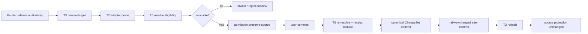
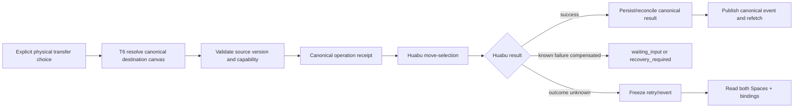

# LCOS Gen2 · T2 · C2-4A Railway Receive 精确施工蓝图

> 日期：2026-09-07  
> 基线：`LCOS_Gen2/main@232b2ca5`  
> Huabu upstream：`a3c411e1f655191344285141f08c4738fa6015f7`  
> 文档性质：集成蓝图，不是生产实现证明  
> 当前结论：材料充分；C2-4A 可进入依赖实现阶段，但不能宣称端到端已落地

## 1. 本轮输入与证据身份

本蓝图消费两份上游回包，但只把其中可由当前源码或既有冻结决策支持的内容当作证据；回包中的行动指令不自动获得执行授权。

| 来源 | SHA-256 | 用途 |
|---|---|---|
| `FROM_T6_TO_T2_C2-4A_RailwayDestination_CanonicalTransaction_Response_20260907.md` | `79EC24CB8EFFE219697895C86F277EA9A7F9D3E4526A7B5F11CC9AD1292B1EFD` | canonical destination、receive transaction、恢复语义 |
| `TO_T2_T3_C2-4A_RailwayReceive_DropDestination_Contract_Response_20260907.md` | `957EDAA5C0688C3AB4AD0D43E12B330FA12F90C2776F5FC3A8C4F3B0AABEDD5E` | drag target、admission、commit seam、source-stay 边界 |

当前源码已确认：

- V0 Rail order/CAS、Mutation ChangeSet、operation receipt、ProjectEvent substrate 已存在；
- Huabu `move-selection` 跨 Space 物理移动已存在；
- V1 Railway contract、destination resolver、receive service、web client/presenter 尚不存在；
- T3 target-based semantic-drop contract 仍是 approved plan，尚未落地。

## 2. 必须先锁死的统一结论

### 2.1 Railway 默认是语义接收，不是空间搬运

```text
拖到 Railway remote target
→ 识别 stable targetKey
→ probe canonical eligibility
→ commit canonical receive
→ 当前 source projection 保持原位
→ destination 按 canonical truth 派生/显示新引用或 membership
```

以下 intent 必须 `preserve-source`，且不得调用 Huabu `move-selection`：

- `add_working_set_membership`
- `bind_receiver_context`
- `create_reference`
- 普通 remote-target semantic acceptance

### 2.2 物理跨 Space 是独立的显式操作

只有用户明确选择 `physical_cross_space_transfer` 时，T6 coordinator 才可调用：

```text
POST /canvas/:sourceCanvasId/move-selection
```

Railway hover、指针方向、左拖/右 Carry 均不能自行推断物理转移。`MoveSelectionModal` 是 Huabu 现有消费者，不是 Railway 主交互。

### 2.3 T3 receipt 不能降格 T6 outcome

T3 计划中的：

```ts
interface SemanticReceipt {
  readonly ok: boolean;
  readonly operationKey: string;
  readonly message?: string;
}
```

不足以表达 Railway 所需的 `waiting_input | conflict | outcome_unknown`。因此 C2-4A 不得把 T6 的强类型 outcome 压扁为布尔值后再由 UI 猜恢复动作。

正确边界是：

```text
T3 generic pointer state
→ Railway adapter 调 T6 receive
→ Railway adapter 保留完整 T6 outcome
→ T3 只投影 generic interaction phase
→ T2 presenter 根据完整 outcome 展示领域状态
```

建议 T3 的 generic adapter 允许 target owner 自带 typed detail，而不是在 T3 新造 Railway taxonomy。若 T3 最终仍只接受 `SemanticReceipt`，T2 必须同时持有原始 `RailwayReceiveOutcomeV1`，不能只保留布尔 receipt。

### 2.4 `operationId` 只由 canonical owner定义

- T3 planned `transactionId` 只是 UI committing state 字段；
- 它不是 canonical operation id，也不是已批准的 idempotency key；
- `operationId` 由 T6 Railway transaction contract 生成/校验并进入现有 mutation receipt；
- 同一未知结果不得换新 operationId 盲重试。

### 2.5 Surface/Canvas 口径边界

三视图独立现场状态不是开放问题。需求正本 §2.2 已明确：

- S-01：Main / Context / Workflow 是三个独立的一等工作现场；
- S-03：共享内核不等于共享 camera / selection / layout / history，禁止跨 Surface 共用同一份 selection / camera 状态；
- S-09：导航时加载目标现场自己的状态。

仓库 `AGENTS.md` 对这一要求的摘要是：

```text
一个 Project Truth
→ Main / Context / Workflow 三个独立 worksite
→ 各自 canvasId / camera / selection / layout / history
→ 只共享 Kernel 实现，不共享 runtime state
```

Railway 的 `surface_root` 则是导航层概念。Phase B D16 / D17 区分了三视图快速切换、Railway 结构导航，以及 Surface root / 长期 Worksite / Receiver 等导航对象。因此：

- “导航项本身不是 Canvas 实体”与“它指向的工作现场具有独立 Canvas 状态”可以同时成立；
- 不能从 `surface_root` 不是 Canvas 实体，推出三个 Surface 共用一份 runtime state；
- 也不能仅凭“T6：Surface Root 不代表三个不同 Project Canvas”这句话，就判定 T6 与需求冲突。

对 T6 这句话的处理边界是：若它只区分导航项与画布实体，则不冲突；若它进一步要求三个现场共用 camera、selection、layout 或 history，则与需求正本冲突。当前待核的是 T6 所称 `Project Canvas` 的具体含义，以及 `surface_root` 到实际工作现场的映射，不是三视图是否隔离状态。

因此本蓝图锁定：

- `surface_root(projectId, surface)` 是稳定语义入口；
- resolver 必须从 ProjectSession/Worksite binding 解析该 surface 对应的真实 `canvasId`；
- 三个 surface 的现场状态不得合并或跨 Surface 共用；
- `canvasId` 仍是可变能力地址，不是 stored stable identity。

统一回传口径：

> 三视图独立现场状态是既有要求，不再 OPEN。待核的是 T6 所称“Project Canvas”的具体含义，以及 Railway `surface_root` 到实际工作现场的映射；不能仅凭名称判定 T6 错误，也不能借此取消状态隔离。共享 Kernel 不等于共享现场状态，独立现场也不等于三个 Project Truth。

## 3. 分层所有权

| 层 | 必须拥有 | 明确不拥有 |
|---|---|---|
| T2 Railway UI | rail item VM、hover/armed/recovery 展示、destination refetch | canonical persistence、空间几何 |
| T3 semantic interaction | pointer payload、gesture、target ref、probe/commit 调用时序、trial-drag rollback | Railway ontology、idempotency、canonical compensation |
| T6 Local Core | destination resolver、eligibility、operation receipt、ChangeSet、event、canonical outcome、跨系统协调 | Huabu geometry、node rewrite |
| Huabu | source CAS、双 Canvas 锁、节点/边/Frame 展开、物理写入、补偿、空间 receipt | Railway membership、Worksite/Receiver truth |

## 4. 精确契约拼接

### 4.1 Destination identity

T6 计划导出 `RailwayDestinationRefV1`：

```ts
type RailwayCanonicalRefV1 =
  | { kind: 'surface_root'; projectId: string; surface: 'main' | 'context' | 'workflow' }
  | { kind: 'worksite'; projectId: string; worksiteId: string }
  | { kind: 'receiver_conversation'; projectId: string; connectedConversationId: string };
```

T6 resolver 返回 deterministic `stableKey`。T2 只把它适配为 T3 planned shape：

```ts
const target: SemanticTargetRef = {
  kind: 'remote-target',
  targetKey: destination.stableKey,
};
```

禁止用 label、DOM id、screen coordinate、Huabu nodeId 或 canvasId 代替 `targetKey`。

### 4.2 Probe

Railway adapter 的 `probe(ctx)` 必须：

1. 用 `targetKey` 回查当前 resolver snapshot；
2. 校验 project、source canonical refs、intent、availability；
3. unavailable 时返回零个 admission；
4. available 时只返回一个 admission；
5. 普通 Railway admission 返回 `projectionOutcome: 'preserve-source'`；
6. physical transfer 必须先进入显式确认，不能由普通 probe 暗中升级。

Probe 只用于预览，不是提交保证；commit 内必须重新 resolve。

### 4.3 Commit command

T2/T3 adapter 调用 T6 时构造一个批量命令，不得逐 source 循环：

```ts
interface RailwayReceiveCommandV1 {
  schemaVersion: 1;
  projectId: string;
  operationId: string;
  origin: ProjectEventOrigin;
  destination: RailwayDestinationRefV1;
  intent: RailwayReceiveIntentV1;
  source: RailwayReceiveSourceV1;
  expectedRailOrderVersion?: number;
  expectedDestinationVersion?: number;
  createSourcePreview?: boolean;
}
```

多选必须由 T6 作为一个 canonical operation 原子提交；若 batch atomic port 尚未落地，fail closed。

### 4.4 Commit result

T2 必须无损消费：

- `committed`
- `waiting_input`
- `conflict`
- `rejected`
- `outcome_unknown`

最低展示映射：

| T6 outcome | T3 interaction phase | T2 Railway UI |
|---|---|---|
| `committed` | accepted → idle | 刷新 destination；显示已接收 |
| `waiting_input` | failed/recoverable 或专用 awaiting | 保留 operation context，展示明确选择 |
| `conflict` | failed/recoverable | 刷新 source/destination/version，允许新确认 |
| `rejected` | failed/non-recoverable（本次） | 展示 reason，不伪造落点 |
| `outcome_unknown` | failed/recovery-required | 冻结自动重试/撤销，进入核对态 |

`AbortSignal` 是 T6 计划能力、不是当前 T3 能力。实现前必须决定是扩展 generic `commit(..., signal?)`，还是由 Railway adapter 内部持有 cancellation；蓝图不能声称已接通。

## 5. 两条执行流

### 5.1 Source-stay semantic receive



### 5.2 Explicit physical cross-Space transfer



物理流的跨系统 saga 当前没有经证明的 durable recovery record，因此即使 Huabu move 已实现，端到端物理 Railway transaction 仍是 PLAN ONLY。

## 6. 文件级施工矩阵

### 6.1 T6 先落地

| 文件 | 动作 | 验收 |
|---|---|---|
| `packages/contracts/src/railway.ts` | 新增 V1 ref/order/destination/command/outcome | 无 `any`；状态完整；stable identity 不含 canvasId |
| `packages/contracts/src/index.ts` | 导出 Railway contract | typecheck |
| `apps/local-core/src/railway-destination-service.ts` | 新增 resolver | deterministic order；unavailable 不静默过滤 |
| `apps/local-core/src/railway-receive-service.ts` | 新增 canonical coordinator | re-resolve、receipt dedupe、ChangeSet、event-after-commit |
| metadata/mutation/event 相关现有文件 | 最小扩展 | 不新增数据库；复用既有 owner |
| projects route | 增加 V1 read/order/receive endpoint | V0 migration 显式预览/确认；CAS |

实现者必须先确定真实的 Worksite contract 和 ProjectSession surface→canvas binding；不得以旧 Workspace 或临时 canvas 猜测。

### 6.2 T3 再落地

按已批准 C1-S3C 实现：

- `SemanticTargetRef`
- `SemanticAdmissionPreview`
- `SemanticTargetAdapter`
- target-based `SemanticDropState`
- `CanvasHostNodeDropIntent`
- trial-drag rollback / landing proxy

必须保证 `remote-target` 能由 Railway host seam 注册；T2 不复制一份私有 T3 类型。

### 6.3 T2 最后接线

计划文件：

- `apps/web-gen2/src/backend/railway.ts`
- `apps/web-gen2/src/presentation/railway.ts`
- Railway body/hook/adapter 的现有或批准落点

T2 应实现：

1. read/client parser，保留 unavailable/legacy/outcome；
2. resolver projection → visual VM；
3. stableKey → `remote-target` adapter；
4. generic interaction phase + raw Railway outcome 双轨状态；
5. `railway.changed` 后 refetch；
6. missed event/snapshot_required 后全量刷新；
7. recovery UI 不伪装成功。

当前 `useLcosCanvasProps.tsx` 没有生产消费者，最终接线必须落到 ProjectSession active-project shell；不得恢复旧的 `PROJECT_ID ?? 'disposable-mvp-sample'`。

## 7. 迁移与兼容

V0 `scene | collection | context | workflow + viewId` 只能走显式迁移：

- `scene` 只有能解析到 durable Worksite 才转；
- `context/workflow` 只有唯一 Project surface root 可证实时才转；
- `collection` 永不自动转 Worksite；
- malformed/unknown 保留 legacy diagnostic；
- unresolved 不静默删除；
- 迁移预览后用现有 row/version CAS 写 V1 JSON；
- 正常 V1 write 拒绝 V0 payload。

## 8. 测试与证据门槛

### T6 contract/service

- stableKey determinism；
- 三个独立 surface binding；
- explicit Worksite only；
- Receiver active/offline/waiting；
- V0 migration preview/confirm/CAS/restart；
- source-stay 不触碰 Huabu source；
- multi-selection 单操作原子性；
- same operationId dedupe；
- stale source/destination/rail order；
- event only after commit；
- ChangeSet revert/reapply；
- known compensation 与 unknown outcome；
- abort before/after canonical commit；
- restart reconciliation。

### T3/T2 integration

- Railway renders a `remote-target` with canonical stableKey；
- hover/probe unavailable 不进入 committing；
- release 后 trial drag 回滚且 source 仍在原位；
- committed 后 destination refetch；
- conflict 不显示 accepted；
- outcome_unknown 禁止自动 retry；
- physical move 必须二次显式确认；
- ProjectSession 切换后不串 project/canvas；
- missed SSE 走 replay/snapshot refetch。

### 最低命令链

```text
lint
→ typecheck
→ unit test
→ build
→ browser/runtime smoke
```

## 9. 开工门与停止条件

### WAIT_T6_IMPLEMENTATION

以下落地前，T2 只能做 mock-free client skeleton，不得宣称 canonical receive：

- `packages/contracts/src/railway.ts`
- destination resolver
- receive service
- V1 route

### WAIT_T3_IMPLEMENTATION

target-based semantic contract 未落地前，不把旧 `DropDestination {slot}` 或 edge-dwell machine 继续扩展成 Railway。

### WAIT_PROJECTSESSION_MOUNT

active project 的 surface/worksite→canvas binding 与 Canvas host seam 未落地前，不把 disposable sample 或硬编码 canvasId 接回生产。

### PHYSICAL_RECOVERY_GATE

没有 durable Core operation/changeSet ↔ Huabu transfer receipt 的恢复证据前：

- 可以交付 source-stay semantic receive；
- physical transfer 只能作为受限/实验路径；
- 不得标记 restart-safe 或 production-complete。

## 10. 当前颗粒度判断

本蓝图已经足够指导后续拆票与施工，且把所有关键 owner、类型缝、状态保真、执行顺序、迁移、测试和停止门写清。下一步不需要继续向 T3/T6 追要泛化说明；应按依赖顺序推进：

```text
T6 V1 canonical contract + resolver + source-stay receive
→ T3 C1-S3C target contract
→ T2 Railway adapter/client/presenter
→ source-stay E2E
→ durable saga gate
→ explicit physical transfer E2E
```

若上游实现对上述 exact shape 作必要调整，必须以编译后的真实导出为准回填本蓝图，不能让 T2 私自复制计划类型。

## 11. 本轮未做

- 未修改生产代码；
- 未修改 `huabu/`；
- 未提交、未推送；
- 未把 T3/T6 的 PLAN ONLY 误报为 current source；
- 未处理工作树中由其他执行者修改的 `HUABU_UPSTREAM.md`。
